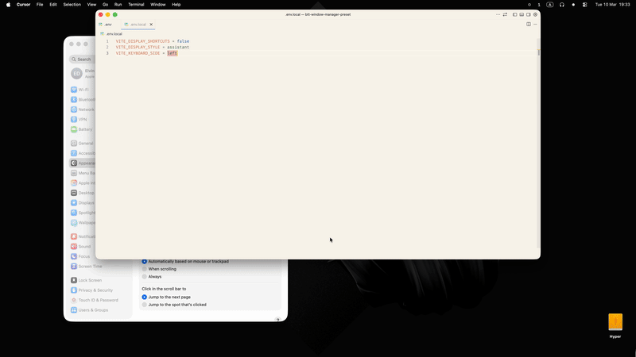
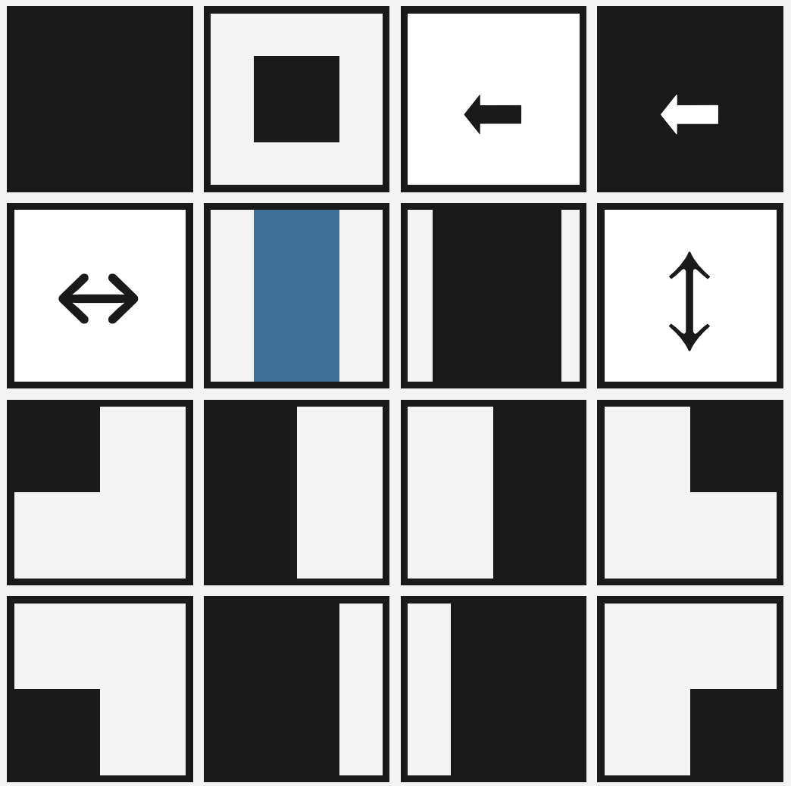
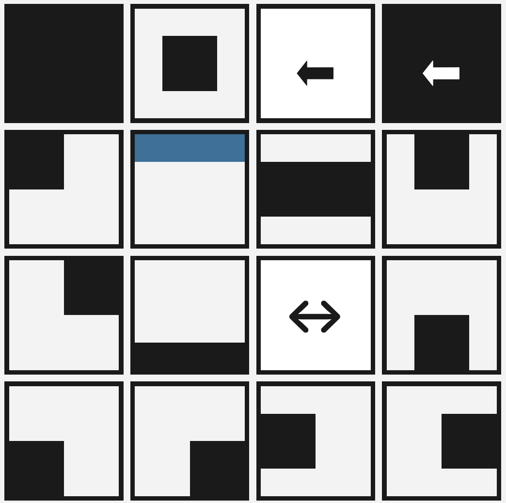
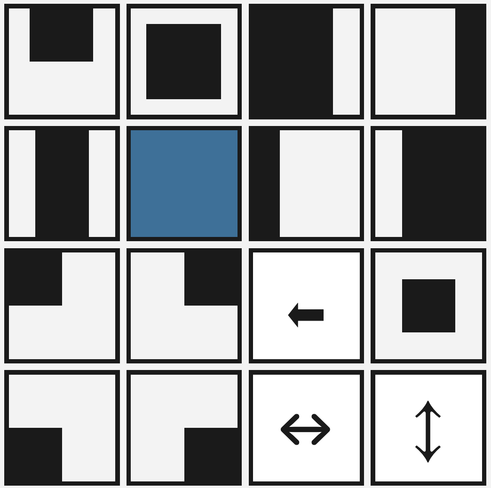
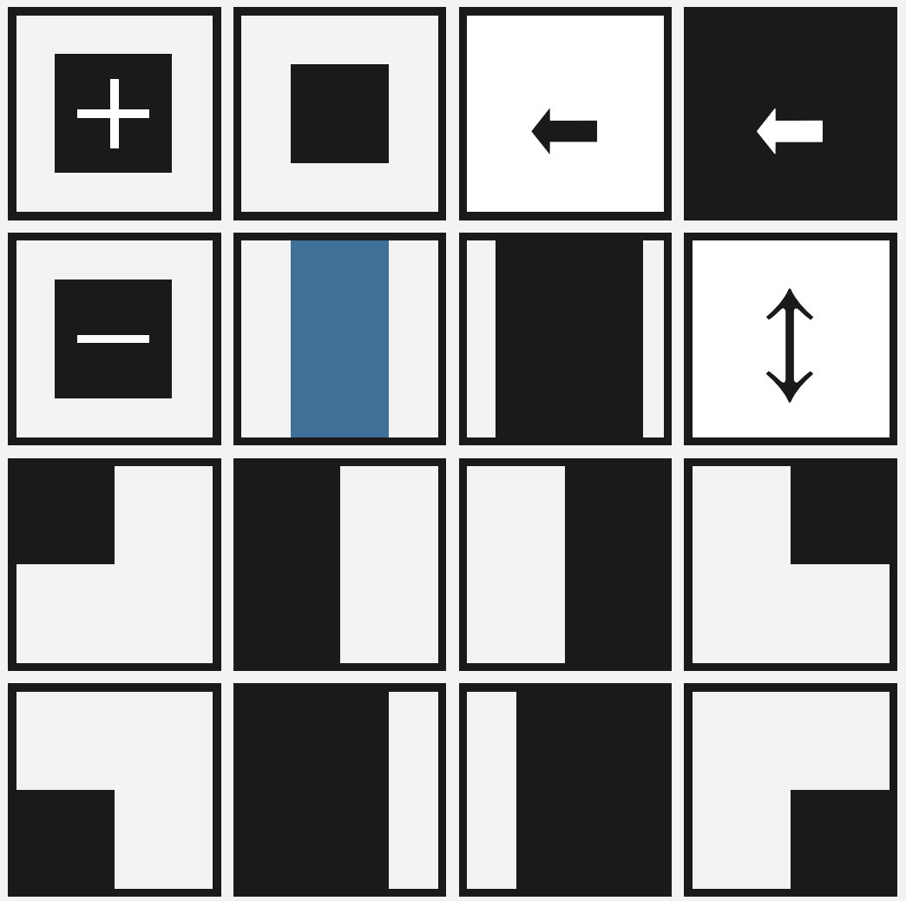
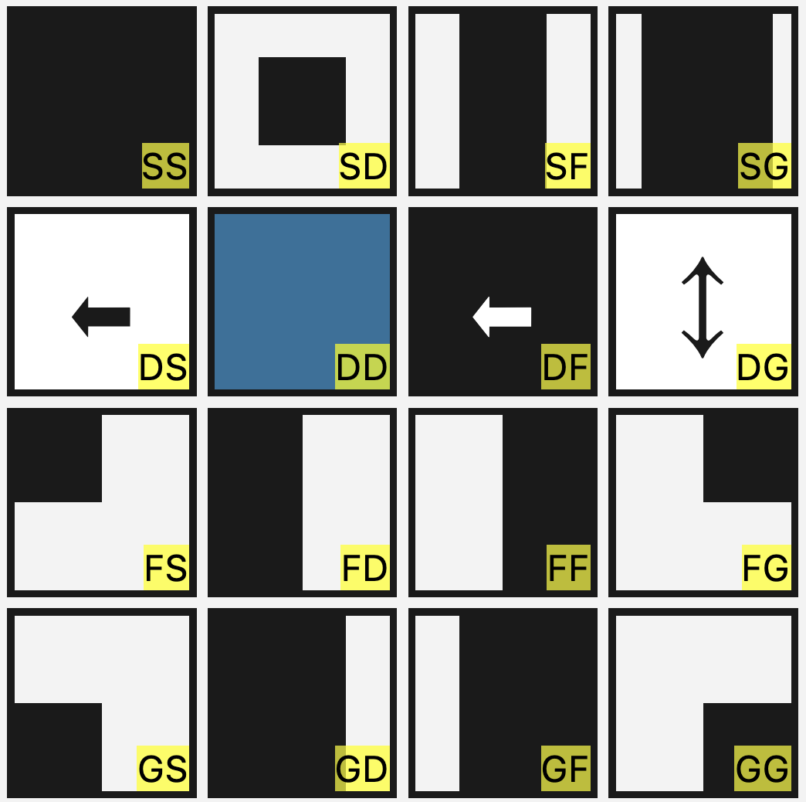
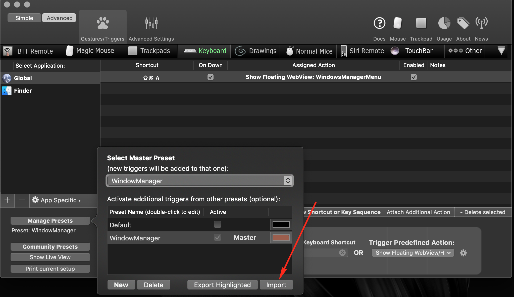
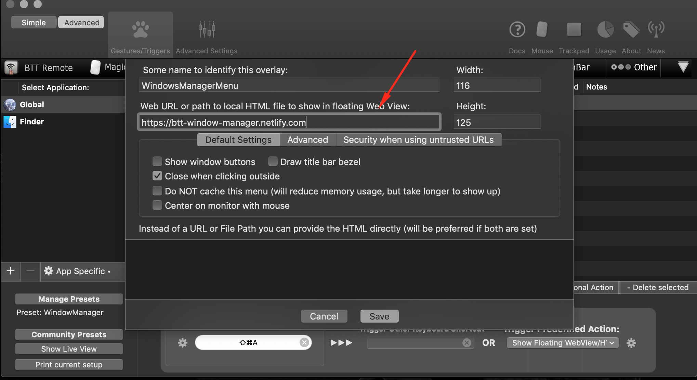
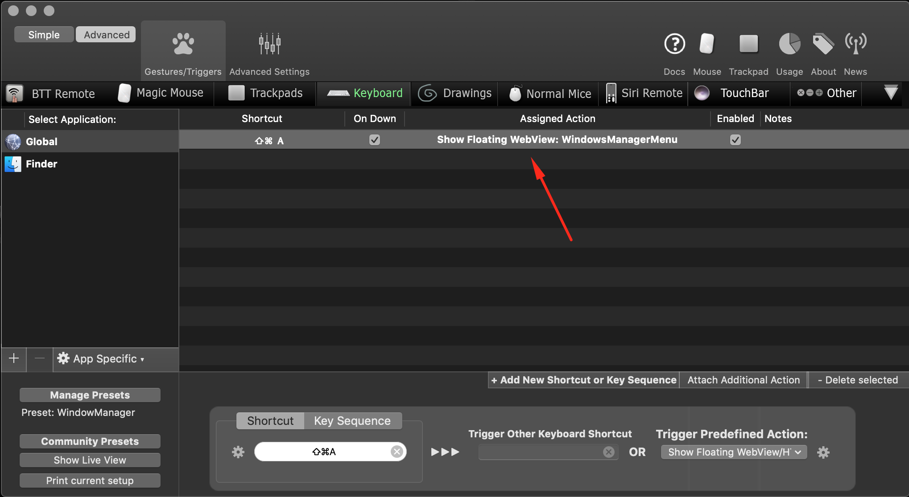

# BetterTouchTool Window Manager preset

Move and resize windows with easy and you don't need to know a lot of commands.
Customise position preset the way you like, or ask your agent!



**Just press `⌘ + ⇧ + A` and click the position**

### Presets

**Horizontal** (default)



**Vertical** — displayed when monitor height × 0.7 > width



**Assistant**



**Advanced**



### Shortcuts (when window manager is displayed)

| Key | Action |
|-----|--------|
| `← ↑ → ↓` | Navigate |
| `Enter` | Select position |
| `A` | Toggle shortcut letters |
| `Esc` / `Backspace` | Go back |
| Letter combo | Ace jump (see below) |



## Installation

After installing BetterTouchTool, you can import/export configurations from the Manage Presets button.

1. **Download preset: [WindowManager.bttpreset](https://github.com/elv1n/btt-window-manager-preset/releases/download/2.0/WindowManager.bttpreset) and [WindowManager.html](https://github.com/elv1n/btt-window-manager-preset/releases/download/2.0/WindowManager.html)**

2. Import preset


3. Change HTML source to a local path eg `/Users/$USER/Downloads/WindowManager.html`




#### Custom installation
1. Clone the repo
2. Install dependencies
```shell
pnpm install
```
3. Edit `.env` or source code.
4. Generate HTML page
```shell
pnpm build
```
5. Import preset `WindowManager.bttpreset`


6. Change HTML source to locally generated file in `<root>/dist/WindowManager.html`

#### Customization

```bash
VITE_DISPLAY_SHORTCUTS = true
VITE_DISPLAY_STYLE = horizontal # horizontal | vertical | size32 | advanced
VITE_KEYBOARD_SIDE = left # left | right
```

* `src/types.ts` define custom preset
* `src/style.css` customize position icon

**How to change the size**
Update css variable in style.css

```css
:root {
	--size: 50px;
	--padding: 3px;
}
```

Run `pnpm build` to generate a new window manager.

#### Done 🤟

## License

Licensed under the [MIT](https://opensource.org/licenses/MIT) license.
