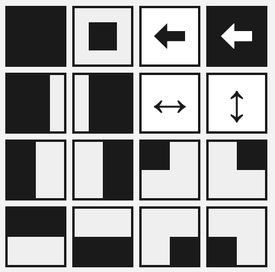
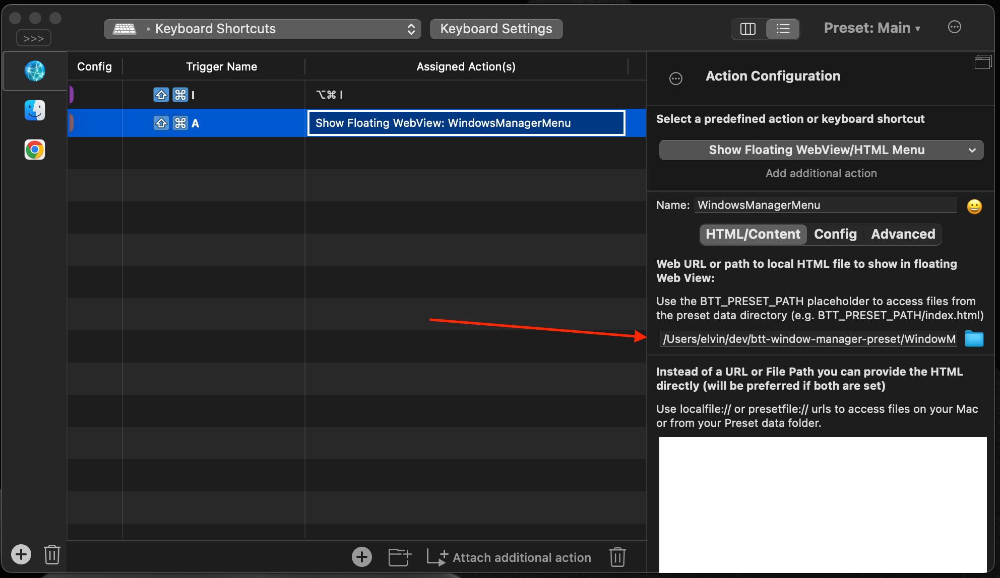

# BetterTouchTool Window Manager

Move and resize windows with easy and you don't need to know a lot of commands.
Customise position preset the way you like!

  

**Just press `⌘ + A` and choose the position**

<center>

</center>


WindowManager display different preset when the monitor height * 0.7 larger then width:
<center>

</center>

**Press `A` again to display shortcuts**
<center>

</center>


Additional commands

*When Menu opened*

* `←, ↑, →, ↓` - moving across the menu with arrow
* `enter` - choose selected position

## Installation

After installing BetterTouchTool, you can import/export configurations from the Manage Presets button.

1. **Download preset: [WindowManager.bttpreset](https://github.com/elv1n/btt-window-manager-preset/releases/download/2.0/WindowManager.bttpreset) and [WindowManager.html](https://github.com/elv1n/btt-window-manager-preset/releases/download/2.0/WindowManager.html)**

2. Import preset


3. Change HTML source to a local path eg `/Users/$USER/Downloads/WindowManager.html`




#### Advanced installation 
1. Clone the repo
2. Install dependencies
```shell
yarn install
```
3. Generate HTML page
```shell
yarn build
```
4. Import preset `WindowManager.bttpreset`


5. Change HTML source to locally generated file in `<root>/dist/WindowManager.html`


### Running local dev server
Run a local dev server to preview changes:
```shell
yarn start
``` 

#### Customization

Create **`.env`**, where you can define next properties

```js
// src/vite-env.d.ts
// display shortcuts
readonly VITE_DISPLAY_SHORTCUTS: "true" | "false";
// different display layout styles
readonly VITE_DISPLAY_LAYOUT:
	| "horizontal"
	| "vertical"
	| "size32"
	| "advanced";
// left side is a default value
// value changing the letters used for shortcuts, right is based on the right keyboard part
readonly VITE_KEYBOARD_SIDE: "left" | "right";
```

for example
```bash
// .env
VITE_DISPLAY_SHORTCUTS = true
VITE_DISPLAY_STYLE = size32
VITE_KEYBOARD_SIDE = right
```

* `src/types.ts` define custom preset
* `src/style.css` customize position icon

**How to change the size**
Update css variable in style.css

```css
:root {
	--size: 50px;
	--padding: 3px;
}
```

Run `yarn build` to generate a new window manager.

#### Done 🤟

## License

Licensed under the [WTFPL](http://www.wtfpl.net/) license.
