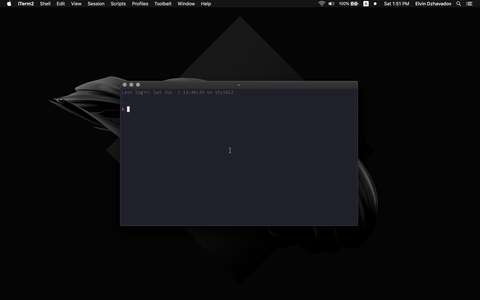

# BetterTouchTool Window Manager

Move and resize windows with easy and you don't need to know a lot of commands.

  

**Just press `⌘ + A` and choose the position**

Additional commands

*When Menu opened*

* `←, ↑, →, ↓` - moving across the menu with arrow
* `enter` - choose active item
* `r` - start/stop resing.
*When you start resizing you need to reopen menu to stop it*

## Installation

After installing BetterTouchTool, you can import/export configurations from the Manage Presets button.

1. **Download preset: [WindowManager.bttpreset](WindowManager.bttpreset)**

2. Import preset

3. Last step is to specify secret key or download html. Check below both methods.

**BTT requires secret key for security reason**

WindowManager [hosted](https://btt-window-manager.netlify.com/) on netlify but you don't have a reason to trust someone from open-source, so it will be easier and saver to download html and change the html link in BTT settings.

#### Self-hosted html
1. Download html: [WindowManager.html](WindowManager.html)
2. Change the link to downloaded html path.

#### Netlify-hosted html

1. Get secret token and add to the link

#### Done 🤟

## License

Licensed under the [WTFPL](http://www.wtfpl.net/) license.