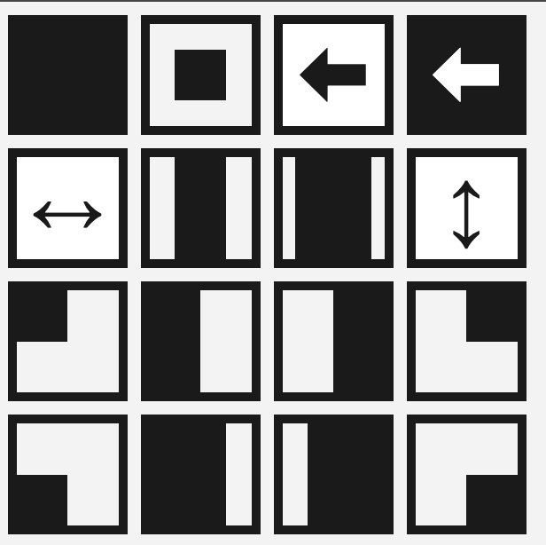

# BetterTouchTool Window Manager

Move and resize windows with easy and you don't need to keep to know a lot of commands.

  

**Just press `⌘ + A` and choose the position**

  

Additional commands
*When Menu opened*

* `←, ↑, →, ↓` - moving across the menu with arrow
* `enter` - choose active item
* `r` - start/stop resing. *When you start resizing you need to reopen menu to stop it*

## Installation

After installing BetterTouchTool, you can import/export configurations from the Manage Presets button.

**Download: [WindowManager.bttpreset](WindowManager.bttpreset)**

## License

Licensed under the [WTFPL](http://www.wtfpl.net/) license.